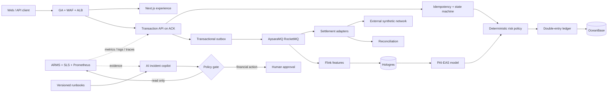

# FinCloud Sentinel

**Cloud-native financial transaction assurance + evidence-grounded AI operations copilot**
**云原生金融交易保障平台 + 证据驱动、人工审批的 AI 运维 Copilot**

[](https://github.com/thunderxu7-sketch/fincloud-sentinel/actions/workflows/ci.yml)
[](https://thunderxu7-sketch.github.io/fincloud-sentinel/)
[](LICENSE)
[](#responsible-use)

**[Live bilingual demo / 中英文演示](https://thunderxu7-sketch.github.io/fincloud-sentinel/)** ·
[Interview explainers / 面试通俗讲解](https://thunderxu7-sketch.github.io/fincloud-sentinel/guides/) ·
[Presales evidence pack / 售前材料](docs/presales/README.md) ·
[Architecture](docs/architecture/high-level-design.md) ·
[OpenAPI](docs/api/openapi.yaml)

FinCloud Sentinel is an interview-ready reference solution for a fintech solution architect or
forward-deployed engineer. It proves the controls behind a trustworthy deposit/withdrawal flow:
integer money, idempotency, explicit state transitions, double-entry settlement, reconciliation,
risk containment, ordered events, SLOs, and a read-only-by-default incident agent.

FinCloud Sentinel 是面向金融科技解决方案架构师 / FDE 的可运行参考项目。它不只展示架构图，
还用代码、测试、指标、Runbook 与验收材料证明充提链路中的资金正确性、可追溯性和故障降级能力。

> **Scope:** synthetic transactions only. This repository is not a custody, exchange, payment,
> AML, or investment product, and it must not process real funds or personal data.

## Web surfaces

| Surface | Purpose | Live route |
|---|---|---|
| Product home | Scope, proof, and entry points | [Home](https://thunderxu7-sketch.github.io/fincloud-sentinel/) |
| Control plane | Transaction, risk, settlement, reconciliation, and containment | [Console](https://thunderxu7-sketch.github.io/fincloud-sentinel/console/) |
| Architecture | Production topology, decisions, and deployment modes | [Architecture](https://thunderxu7-sketch.github.io/fincloud-sentinel/architecture/) |
| Runbooks | Incident procedures and signal-to-control matrix | [Runbooks](https://thunderxu7-sketch.github.io/fincloud-sentinel/runbooks/) |
| Interview explainers | Plain-language concepts, implementation evidence, and answer scripts | [Guides](https://thunderxu7-sketch.github.io/fincloud-sentinel/guides/) |

## Plain-language interview explainers

| Capability | Standalone guide |
|---|---|
| Financial transactions: idempotency, state machine, double-entry, reconciliation, risk | [01 Financial transaction assurance](https://thunderxu7-sketch.github.io/fincloud-sentinel/guides/01-financial-transaction.html) |
| Cloud architecture: containers, Kubernetes, Helm, Terraform, observability, DR | [02 Cloud architecture](https://thunderxu7-sketch.github.io/fincloud-sentinel/guides/02-cloud-architecture.html) |
| AI delivery: RAG, redaction, guardrails, evaluation, human approval | [03 Governed AI delivery](https://thunderxu7-sketch.github.io/fincloud-sentinel/guides/03-ai-delivery.html) |
| Presales: discovery, selection, POC, RFP, TCO/ROI, delivery planning | [04 Presales delivery](https://thunderxu7-sketch.github.io/fincloud-sentinel/guides/04-presales-delivery.html) |
| Engineering: tests, CI, CodeQL, Trivy, public code, online demonstration | [05 Engineering evidence](https://thunderxu7-sketch.github.io/fincloud-sentinel/guides/05-engineering-evidence.html) |
| Decision-level Q&A: funds safety, ledger, RTO/RPO, AI governance, cloud selection, POC value | [06 Six key interview questions](https://thunderxu7-sketch.github.io/fincloud-sentinel/guides/06-key-interview-questions.html) |

Every guide starts with a familiar analogy, distinguishes the current reference implementation
from its production mapping, and includes reusable answer scripts, evidence, follow-up reasoning,
and a practice checklist. The directory and all local links are validated by `npm run guides:check`.

## What is demonstrable

| Concern | Executable evidence | Production mapping |
|---|---|---|
| Transaction integrity | BigInt atomic units, versioned state machine, idempotent replay | OceanBase + Tair + KMS |
| Accounting integrity | Balanced debit/credit entries and reconciliation engine | Strongly consistent ledger + immutable archive |
| Event reliability | Transactional outbox and consumer inbox schema | ApsaraMQ for RocketMQ ordered/transactional messages |
| Real-time risk | Deterministic signals and fail-closed review/block | Flink + Hologres + PAI-EAS |
| AI governance | Retrieval citations, injection detection, redaction, tool allowlist, approval gate | Model Studio + PAI-EAS + SLS/ActionTrail |
| Reliability | Prometheus SLO rules, Grafana dashboard, k6 and chaos scorecards | ACK + ARMS + Managed Prometheus + SLS |
| Delivery | Docker Compose, hardened Helm chart, Alibaba Cloud Terraform reference | ACR + ACK + ALB/WAF/GA |
| Presales | Discovery, NFRs, POC, TCO, RFP, competitive and executive materials | Reusable customer engagement assets |

## Try the control loop in 90 seconds

The dedicated [control plane](https://thunderxu7-sketch.github.io/fincloud-sentinel/console/)
executes the same risk, state-machine, money, ledger, and
reconciliation modules covered by the test suite. It is not a prerecorded scenario:

1. Open **交易实验台 / Operations lab** and load **人工审核 / Review**.
2. Submit the withdrawal and inspect the calculated score, policy reasons, state, and event stream.
3. Explicitly approve the risk review, then broadcast and settle the transaction.
4. Replay the same idempotency key and verify that the attempt count increases without another
   transaction or ledger posting.
5. Inject an external amount mismatch and run reconciliation. The report is calculated from the
   selected transaction, double-entry ledger, and synthetic settlement evidence.
6. Run the governed investigator, follow its citations, approve containment, and export the full
   evidence bundle as JSON.

Session data is synthetic and persisted only in the current browser. The Pages build uses an
offline domain-engine mode so it needs no cloud bill or secrets; Docker Compose exposes the same
capabilities as Fastify/FastAPI services for API and observability demonstrations.

## Architecture



Key design decisions are recorded in [`docs/architecture/decisions.md`](docs/architecture/decisions.md).
The local POC is intentionally smaller than the production mapping; boundaries are explicit in
[`docs/architecture/high-level-design.md`](docs/architecture/high-level-design.md).

## Quick start

### Prerequisites

- Node.js `>=22.13`
- Python `>=3.11` and [uv](https://docs.astral.sh/uv/)
- Docker Desktop (for the full stack)

### Run from source

```bash
npm ci
uv sync --project services/ai-copilot --extra dev
npm run dev                         # web :3000, API :4000
uv run --project services/ai-copilot uvicorn app.main:app \
  --app-dir services/ai-copilot --reload --port 8000
```

### Run the full observability stack

```bash
docker compose up --build -d
./scripts/smoke-test.sh
```

| Surface | URL |
|---|---|
| Demo UI | http://localhost:3000 |
| Core API | http://localhost:4000/healthz |
| Copilot OpenAPI | http://localhost:8000/docs |
| Prometheus | http://localhost:9090 |
| Grafana | http://localhost:3001 (`admin` / `fincloud-demo`) |

Prometheus and Grafana use bounded `tmpfs` storage for a zero-cleanup demo. Stop the stack with
`docker compose down`.

### Do I need an Alibaba Cloud server now?

No. The interview demo, automated tests, Docker stack, presentation, and TCO model all run locally
or on GitHub Pages. The Terraform reference defaults to `create_ack = false`; create short-lived,
pay-as-you-go cloud resources only after the local POC passes and a customer needs cloud benchmark,
network, KMS, or disaster-recovery evidence. Never leave an interview environment running by default.

## Quality gates

```bash
npm run check              # lint, API contract, TS checks, 20 tests, AI evals, docs, build
npm run test:e2e           # 4 flows: control loop + bilingual mobile + routes + guide publication
helm lint infra/helm/fincloud-sentinel
helm template sentinel infra/helm/fincloud-sentinel >/tmp/fincloud.yaml
```

The CI workflow also scans secrets, dependencies, containers, IaC, and the exported site. The AI
evaluation fails unless every case retrieves the expected runbook and no consequential action can
run without approval.

## Repository map

```text
apps/web/                     bilingual Next.js surfaces + six standalone interview explainers
packages/domain/              money, state machine, risk, ledger, reconciliation
services/core-api/            Fastify API and Prometheus metrics
services/ai-copilot/          FastAPI RAG/guardrail reference and evaluation set
infra/helm/                   hardened Kubernetes release for ACK
infra/terraform/              optional Alibaba Cloud environment reference
infra/sql/                    durable ledger, outbox, and inbox schema
observability/                Prometheus rules, Grafana dashboard, OTEL redaction
ops                           (represented by docs/runbooks and tests/chaos)
docs/presales/                complete bilingual presales evidence pack
tests/performance/            k6 SLO test
evals/                        deterministic AI safety/retrieval cases
```

## Presales path

1. Use the [discovery guide](docs/presales/01-discovery-questionnaire.md) to separate business
   outcomes from requested products.
2. Baseline volumes, controls, data residency, and recovery objectives in the
   [requirements matrix](docs/presales/02-requirements-and-nfr.md).
3. Tailor the [executive proposal](docs/presales/00-executive-proposal.md) and
   [solution brief](docs/presales/13-solution-brief.md).
4. Agree success gates in the [POC plan](docs/presales/05-poc-plan-and-scorecard.md).
5. Quantify the decision with the [TCO/ROI model](docs/presales/08-tco-roi-model.md) and
   [competitive comparison](docs/presales/09-cloud-comparison.md).
6. Run the [20-minute demo script](docs/presales/12-demo-script.md), record evidence, and obtain
   a customer decision—never declare success from a slide alone.

## Responsible use

- No real credentials, funds, wallets, customer records, sanctions decisions, or regulated advice.
- Risk scores and incidents are deterministic demonstrations, not AML or fraud models.
- Production adoption requires legal/compliance approval, threat modeling, data classification,
  model validation, vendor review, capacity testing, and audited operational ownership.
- The AI copilot cannot mutate financial state; any proposed consequential action remains behind a
  two-person human approval gate.

## License and security

Apache-2.0. See [SECURITY.md](SECURITY.md), [CONTRIBUTING.md](CONTRIBUTING.md), and
[`docs/presales/06-security-threat-model.md`](docs/presales/06-security-threat-model.md).
