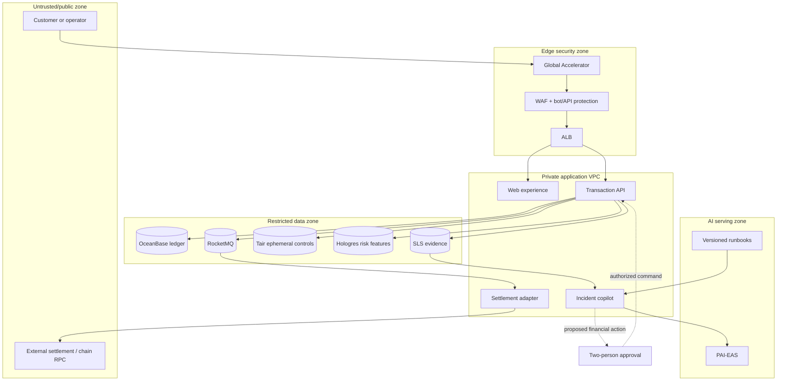
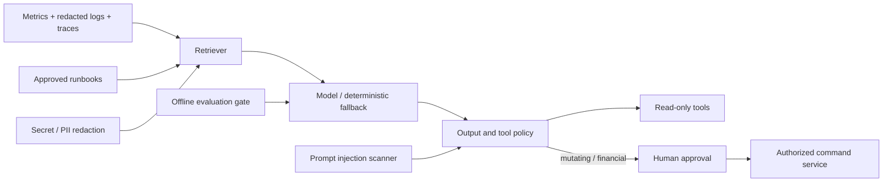

# High-level design / 高阶架构设计

**Status:** reference architecture · **Data:** synthetic only · **Target:** financial transaction
assurance on Alibaba Cloud

## 1. Outcome and quality attributes

The platform accepts deposit/withdrawal intents, makes a deterministic risk decision, controls the
state transition, records balanced settlement entries, reconciles external settlement, and exposes
read-only incident evidence to an AI copilot. The architecture optimizes in this order:

1. **Funds safety:** no duplicate or unbalanced posting; fail closed when certainty is lost.
2. **Auditability:** immutable business identifiers, versioned decisions, evidence retention.
3. **Availability:** multi-zone stateless services and explicit dependency fallbacks.
4. **Latency:** p95 API <250 ms excluding external settlement; risk model <200 ms target.
5. **Operability:** metrics/logs/traces tied by request, transaction, event, and model version.
6. **Cost:** managed services only where they reduce failure or operational risk.

## 2. Context and trust boundaries



No access key, signing key, raw PII, or unrestricted log is exposed to the model. External RPC data
is untrusted. The public GitHub Pages demo is a static, isolated representation with no backend.

## 3. Component responsibilities

| Component | Owns | Must not own |
|---|---|---|
| Web | Workflow UX, status projection, accessibility | Accounting truth or secret material |
| Transaction API | Validation, idempotency, state transition, orchestration | External confirmation truth |
| Risk policy | Versioned allow/review/block decision and reason codes | Ledger mutation |
| Ledger | Atomic balanced debit/credit posting | Cache-derived truth |
| Outbox publisher | Durable event delivery after local commit | Business-state decisions |
| Settlement adapter | Provider abstraction, signing boundary, confirmations | Final internal accounting |
| Reconciliation | Internal/external comparison and issue creation | Silent repair of discrepancies |
| Incident copilot | Evidence retrieval and safe recommendations | Autonomous consequential action |
| Observability | Correlated evidence, SLOs, detection | Credentials or full sensitive payloads |

## 4. Critical transaction flow

```mermaid
sequenceDiagram
  autonumber
  participant C as Client
  participant A as Transaction API
  participant T as Tair
  participant R as Risk policy / PAI-EAS
  participant O as OceanBase
  participant Q as RocketMQ
  participant S as Settlement adapter
  participant X as External network

  C->>A: POST transaction + Idempotency-Key
  A->>T: Reserve short-lived request key
  A->>O: SELECT/INSERT unique idempotency_key
  A->>R: Evaluate versioned features
  alt allow
    A->>O: Commit APPROVED + outbox atomically
    O-->>Q: Publish after commit
    Q->>S: Ordered event (transaction_id shard)
    S->>X: Broadcast with provider idempotency
    X-->>S: Confirmation observations
    S->>O: Versioned CONFIRMING → COMPLETED
    S->>O: Balanced ledger posting + outbox
  else review or uncertainty
    A->>O: Persist RISK_REVIEW; move no funds
  else block
    A->>O: Persist REJECTED + reason codes
  end
  A-->>C: Stable transaction ID and status
```

**Exactly-once business effect, not exactly-once transport:** unique keys, optimistic versioning,
outbox, inbox receipts, and idempotent handlers make redelivery safe. RocketMQ ordering is scoped by
transaction ID; the design does not claim global order.

## 5. Data and consistency

- Monetary values are integer atomic units; no IEEE-754 values enter accounting.
- `transactions.idempotency_key` is unique. A retry returns the original result.
- A completed transaction writes at least one debit and one equal credit in the same local commit.
- Ledger entries are append-only; corrections use compensating entries, never destructive updates.
- Reconciliation compares business ID, asset, atomic amount, status, and confirmation policy.
- Tair accelerates idempotency/velocity controls but OceanBase remains the durable authority.
- Hologres stores derived features and analytics, not the source-of-truth ledger.

Reference DDL: [`infra/sql/schema.sql`](../../infra/sql/schema.sql).

## 6. AI control plane



Guardrails are deterministic and outside the model: data classification, retrieval allowlist,
prompt-injection signals, secret redaction, typed tool schemas, read-only default, maximum latency,
model fallback, evidence citations, and approval for every consequential action. Evaluation data is
versioned under `evals/`.

## 7. Availability, DR, and scaling

| Layer | Availability design | Failure behavior |
|---|---|---|
| Edge | GA/WAF/ALB health routing | Remove unhealthy target; rate-limit abuse |
| ACK | 3 zones, topology spread, PDB, HPA | Continue within SLO after one pod/zone fault |
| OceanBase | multi-replica strong consistency | Prefer consistency; reject uncertain writes |
| RocketMQ | managed HA, ordered key by transaction | redelivery is safe through inbox/idempotency |
| PAI-EAS | min replicas, canary, autoscaling | timeout opens breaker; deterministic rules |
| Observability | independent retention and alert paths | core money flow remains non-dependent |
| Region | warm standby and encrypted backups | declared failover after evidence-based gate |

Targets and restore tests are defined in the DR plan; they are requirements, not unverified claims.

## 8. Observability and SLO model

Every request carries `request_id`; every business flow adds `transaction_id`, `event_id`,
`risk_policy_version`, and `model_version`. Sensitive values are omitted or tokenized.

- Availability SLI: successful eligible API responses / eligible requests.
- Correctness SLI: completed transactions with balanced ledger and matched settlement / completed.
- Latency SLI: request duration excluding asynchronous settlement.
- AI safety SLI: consequential actions executed without valid approval (target zero).
- Evidence SLI: agent conclusions with at least one approved source.

Prometheus rules and dashboards are under `observability/`; see the SLO runbook for burn-rate gates.

## 9. Local implementation vs. production mapping

| Local public reference | Production expectation |
|---|---|
| In-memory domain service | OceanBase transaction repository and immutable archive |
| Deterministic risk signals | Flink/Hologres feature plane + PAI-EAS model + rules fallback |
| Outbox array + SQL schema | DB outbox publisher to RocketMQ with inbox deduplication |
| Markdown retrieval | approved vector/keyword index with document ACL and version |
| Prometheus/Grafana Compose | Managed Prometheus + ARMS + SLS + ActionTrail |
| Static GitHub Pages | WAF/ALB-protected Next.js deployment on ACK/CDN |

This distinction prevents a demo from being misrepresented as production readiness.

## 10. Open risks

1. Cross-border data transfer and model-provider location require legal review before design freeze.
2. External settlement finality differs by rail/chain and needs asset-specific confirmation policy.
3. A global active-active ledger is deliberately excluded until ownership and conflict semantics are proven.
4. Managed product quotas, edition availability, and pricing must be revalidated in the target region.
5. AI response quality does not substitute for deterministic monitoring or operator competence.
