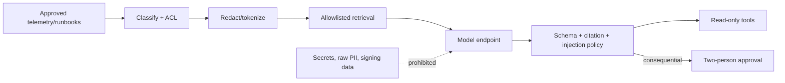

# Security and AI threat model

**Method:** assets/trust boundaries + STRIDE + abuse cases. **Scope:** reference transaction,
reconciliation, observability and incident-copilot paths. **Not a certification or penetration test.**

## Crown-jewel assets

1. Financial state, ledger integrity and reconciliation evidence.
2. Signing/custody keys and privileged commands (production design only; absent from public demo).
3. Customer identity/PII and risk signals.
4. Policy/model/runbook versions and decision audit trail.
5. Cloud/RAM, CI/CD, container and dependency supply chain.
6. Availability during volatility or attack.

## Security invariants

- No financial state change without authenticated, authorized, idempotent and audited command.
- No ledger posting unless debit equals credit and transaction state/version permits it.
- No model has direct credentials or unrestricted mutating tools.
- No sensitive payload enters logs, prompts, traces or public artifacts.
- No production workload uses long-lived access keys when workload identity is available.
- Recovery cannot reopen settlement until invariants and reconciliation pass.

## Threat and control register

| ID | Threat / abuse case | Primary controls | Verification | Residual owner |
|---|---|---|---|---|
| T01 | Credential theft / account takeover | OIDC/RRSA, MFA, short sessions, conditional access, no static keys | IAM review + simulated expired/stolen token | security |
| T02 | API replay / duplicate withdrawal | signed request context, nonce/idempotency unique key, timestamp window, rate limits | 100-way replay test | transaction owner |
| T03 | Parameter/state tampering | strict schema, server-side policy, state machine, optimistic version | negative transition/fuzz tests | engineering |
| T04 | Ledger manipulation | append-only role, balanced atomic commit, dual control, immutable evidence | permission and invariant test | finance/risk |
| T05 | Message loss/duplication/order abuse | outbox/inbox, event ID, partition key, DLQ, schema version | restart/redelivery/out-of-order chaos | platform |
| T06 | Malicious external settlement/RPC | provider quorum/verification, allowlist, TLS, finality policy, reconciliation | forged/reorg/latency scenarios | integration |
| T07 | Injection / deserialization / SSRF | typed input, egress policy, URL allowlist, safe parser, WAF | SAST/DAST and abuse tests | application security |
| T08 | DDoS / resource exhaustion | Anti-DDoS/GA/WAF/ALB limits, queue backpressure, quotas, HPA/circuit breaker | burst and dependency stress | SRE |
| T09 | Insider financial action | segregation of duties, two-person approval, just-in-time role, ActionTrail | privilege and approval drill | compliance/security |
| T10 | Secret/PII leakage to telemetry/model | classification, field allowlist, tokenization/redaction, DLP, short retention | canary-secret test and log scan | privacy |
| T11 | Prompt injection / poisoned runbook | content trust labels, signed/versioned corpus, injection detector, citation and tool policy | adversarial eval suite | AI governance |
| T12 | Hallucinated incident action | evidence threshold, typed read-only tools, deterministic fallback, approval | eval + zero unsafe action metric | incident commander |
| T13 | Model evasion/drift/failure | feature validation, shadow/canary, performance/drift monitoring, rules fail closed | timeout/drift game day | model risk |
| T14 | Supply-chain compromise | signed commits/images, lockfiles, SBOM, CodeQL/SCA, admission policy, digest pin | CI scan and provenance check | platform security |
| T15 | CI/cloud privilege escalation | isolated runners, least-privilege OIDC, protected environment, no fork secrets | pipeline permissions test | DevSecOps |
| T16 | Backup theft or destructive recovery | KMS encryption, immutable/cross-account copy, restricted restore, audit | isolated restore and access review | SRE/security |
| T17 | Cross-tenant/data-region exposure | account/VPC/workspace isolation, private endpoints, region policy, ABAC | architecture and data-flow review | privacy/legal |
| T18 | Vulnerable dependency/container | minimal non-root images, read-only FS, patch SLA, Trivy/SCA | release gate and runtime policy | service owner |

## AI data flow and policy

### Prohibited

- private/signing keys, authentication tokens, raw payment/card identity, sanctions-list decisions;
- arbitrary shell/SQL/HTTP, tool discovery, policy changes, deployment or settlement without approval;
- using customer prompts/outputs for provider training unless contractually approved;
- treating model confidence as calibrated financial risk without validation.

## Release gates

1. Threat model and data-flow owner approval.
2. No hardcoded secret; SAST/SCA/CodeQL/container/IaC scan within agreed vulnerability SLA.
3. Financial invariant, authorization, replay, injection/redaction and unsafe-tool tests pass.
4. SBOM, image digest, build provenance and rollback artifact retained.
5. Pen test/red team for production scope; critical/high findings resolved or formally accepted.
6. Data protection, model risk, legal and compliance approvals recorded.

## Incident evidence preservation

Freeze relevant application/config/model versions, store redacted logs/traces and cloud audit events,
record hashes and collection time, restrict access, maintain legal-hold policy, and never allow an AI
assistant to alter the evidence source.
